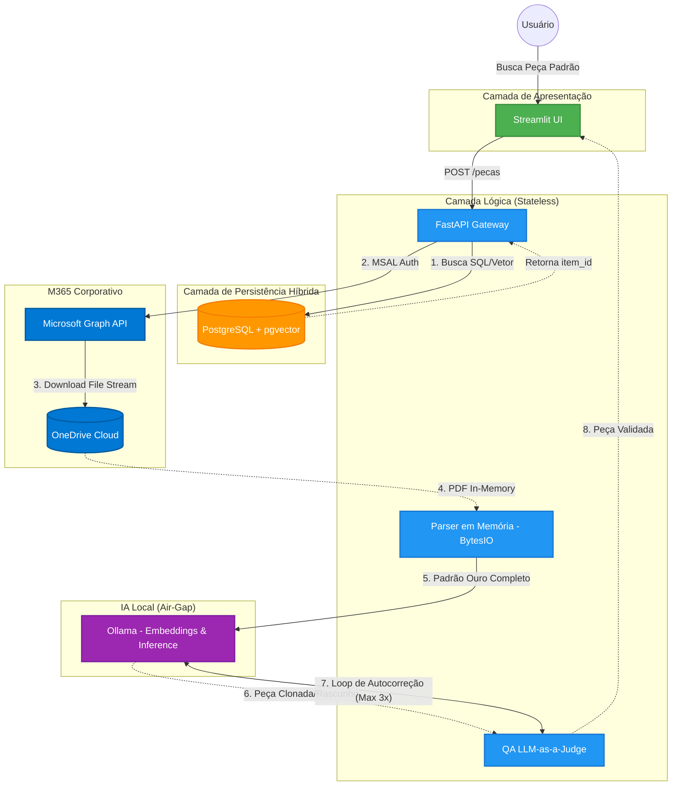

# Ovid.IA - Copiloto Jurídico Air-Gap (Enterprise Edition) ⚖️🤖

O Ovid.IA é um assistente jurídico (LegalTech) focado em **Sigilo Absoluto e Privacidade de Dados (LGPD)**. Através de uma arquitetura estrita de *Air-Gap Inference*, o sistema opera modelos fundacionais (LLMs) totalmente locais (sem nuvem pública), garantindo que dados corporativos, contratos e peças processuais sensíveis jamais sejam enviados a provedores terceiros como OpenAI, Anthropic ou Google.

O sistema integra-se nativamente ao ecossistema Microsoft 365, extraindo o acervo do escritório diretamente do **OneDrive Corporativo** para a Memória RAM, preservando o modelo operacional da firma sem comprometer a segurança.

---

## 🏛️ Visão Arquitetural

A infraestrutura é modular e conteinerizada (stateless), desenhada para rodar desde o *bare-metal* do escritório até instâncias isoladas em VPC na AWS.

### Tech Stack
- **Orquestração:** Docker Compose.
- **Armazenamento de Ficheiros:** Microsoft OneDrive via Graph API (`msal`). Zero persistência local (ETL In-Memory).
- **Banco de Dados (Vetor e Relacional):** PostgreSQL 16 com extensão `pgvector`.
- **Backend (API Gateway):** FastAPI (Python).
- **Frontend (Interface do Advogado):** Streamlit.
- **Motor de IA (Air-Gap):** Ollama executando localmente modelos LLM (*Hermes 3*, *Qwen 2.5*) e de *Embeddings*.

---

## 🏗️ Diagrama de Arquitetura (Mermaid)



---

## 🧠 Fluxos de Engenharia Críticos

### 1. Ingestão e Vetorização Segura (In-Memory ETL)
Para garantir conformidade extrema, o Ovid.IA não salva documentos físicos (PDFs, DOCXs) no disco local. 
O backend conecta-se à Graph API, faz o download do arquivo diretamente para um `io.BytesIO` na Memória RAM. O texto é extraído, fatiado e vetorizado pelo modelo local. Em seguida, os *Embeddings* e *Metadados* (incluindo o `onedrive_item_id`) são gravados no PostgreSQL, e o arquivo PDF é apagado da RAM pelo *Garbage Collector*.

### 2. Módulo de Padronização (RAG Small-to-Big)
Ao buscar jurisprudência interna ou pedir a redação de uma peça:
1. **Recuperação Categórica (Small):** O sistema executa uma Query Híbrida no `pgvector`, filtrando pelos metadados relacionais (Ex: `Categoria = Societário`) associado ao cálculo de Distância Euclidiana L2 dos vetores.
2. **Injeção de Padrão Ouro (Big):** Após encontrar o vetor mais semelhante, o Ovid.IA **não** envia apenas aquele pequeno fragmento ao LLM. Usando o `item_id`, ele faz o download do documento na íntegra no OneDrive e o joga no Contexto do LLM para guiar o clone estrutural.

### 3. Disjuntor de Qualidade (Quality Assurance Circuit Breaker)
Todo rascunho de peça gerado pelo LLM passa por um *Pipeline Determinístico e Semântico*:
- **Validações Hard:** Regex valida formatos de CNPJ, Datas, e Máscaras de Processo.
- **Semântica (LLM-as-a-Judge):** Um segundo agente de IA analisa se o texto cumpre as exigências.
Se o LLM alucinar, o sistema engatilha um loop de autocorreção invisível ao usuário final, possuindo uma "trava" (circuit breaker) de 3 tentativas máximas para evitar gargalo computacional.

---

## 📁 Estrutura de Diretórios (Monorepo)

```text
ovid_ia/
├── backend/
│   ├── app/
│   │   ├── main.py                 # FastAPI Router & Gateway
│   │   ├── services/
│   │   │   ├── onedrive_service.py # Autenticação MSAL e in-memory file handling
│   │   │   ├── parser.py           # Processamento OCR/Texto (BytesIO)
│   │   │   └── vector_db.py        # Conexão psycopg2 com PGVector
├── frontend/
│   └── app.py                      # UI em Streamlit
├── docker-compose.yml              # Orquestração local do PGVector
└── .env                            # Credenciais Secretas (Ignorado no Git)
```

---

## 🚀 Guia de Instalação e Execução

### 1. Pré-Requisitos
- **Docker** instalado.
- **Python 3.12+**.
- **Ollama** rodando localmente com os modelos `hermes3:8b` (ou similar) instalados.
- Registro de Aplicação no **Entra ID (Azure)** com API Permissions do tipo *Application* em `Files.Read.All`.

### 2. Configurando as Variáveis de Ambiente
Crie um arquivo `.env` na raiz do projeto contendo as seguintes chaves de acesso:

```env
# Banco de Dados
POSTGRES_USER=ovidia_user
POSTGRES_PASSWORD=ovidia_password
POSTGRES_DB=ovidia_db

# Integração Microsoft 365 (Graph API - Client Credentials)
ONEDRIVE_TENANT_ID=seu-tenant-id
ONEDRIVE_CLIENT_ID=seu-client-id
ONEDRIVE_CLIENT_SECRET=seu-client-secret
```

### 3. Subindo o Banco de Dados
Na raiz do projeto, instancie o PostgreSQL com extensão `pgvector`:
```bash
docker-compose up -d
```

### 4. Inicializando os Serviços (Locais)
Com os ambientes virtuais em Python configurados, inicie o ecossistema:

**Terminal 1 (Backend):**
```bash
cd backend
source .venv/bin/activate
uvicorn app.main:app --reload --port 8000
```

**Terminal 2 (Frontend):**
```bash
source backend/.venv/bin/activate
streamlit run frontend/app.py
```

---

## ☁️ Transição para a Nuvem (Fase 3 - Scalability)
O Ovid.IA foi concebido seguindo os princípios do *12-Factor App*, facilitando o Lift-and-Shift para a Amazon Web Services (AWS):
- **FastAPI/Streamlit:** Hospedagem direta no *Amazon ECS* via instâncias *Fargate* ou *EC2*.
- **Postgres:** Migração *plug-and-play* para *Amazon RDS for PostgreSQL* (que já possui suporte nativo ao pgvector).
- **Ollama:** Substituição pelo framework corporativo `vLLM` orquestrado em Clusters GPU (`g5.xlarge`) dentro de sub-redes totalmente privadas (VPC Isolada).
