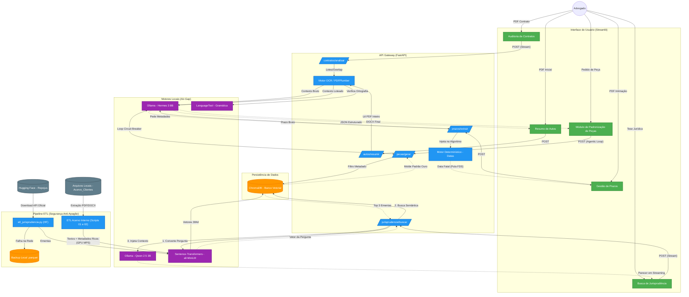

# Arquitetura Ovid.IA (Atualizada - Versão Final)

Abaixo está o diagrama completo de como os componentes do Ovid.IA estão interligados após as implementações finais (Intake Estruturado, RAG com Qwen 2.5 3B e Streaming).

